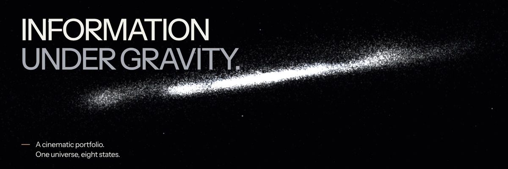
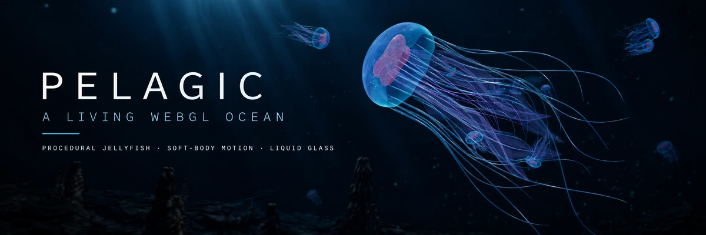
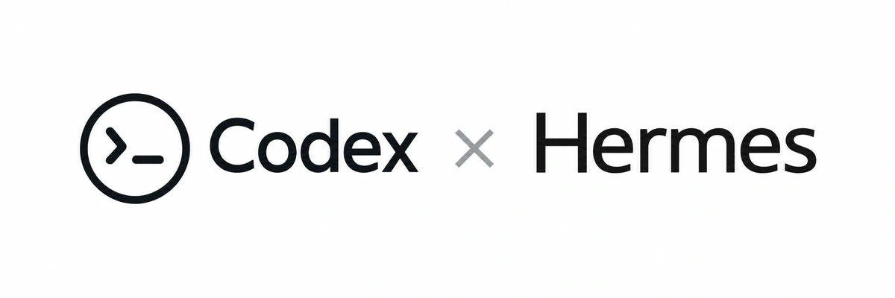
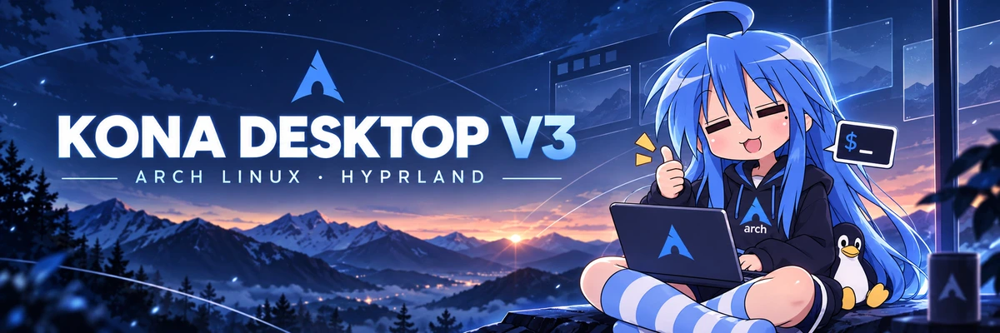
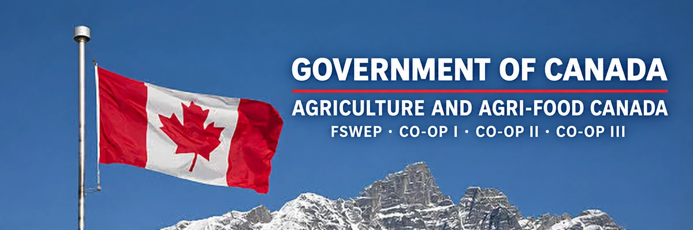

# MANI MARAMI MILANI
**Computer Science × Mathematics** 

[Portfolio](https://manimarami.com) · [GitHub projects](https://github.com/Denoax?tab=repositories) · [LinkedIn](https://www.linkedin.com/in/mani-marami-milani-8713a7309/) · [Pelagic live experience](https://denoax.github.io/pelagic-jellyfish-webgl/)

