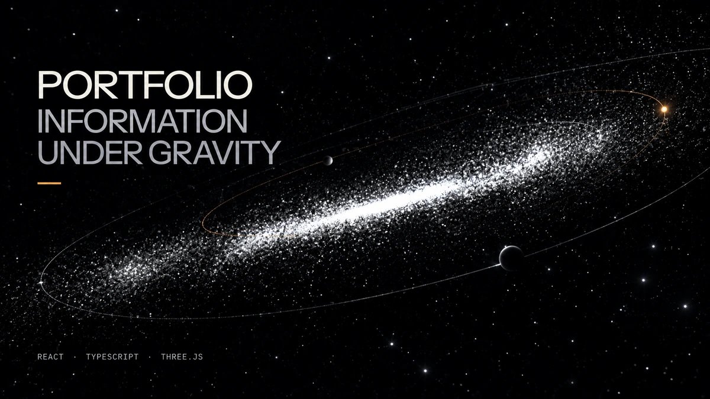
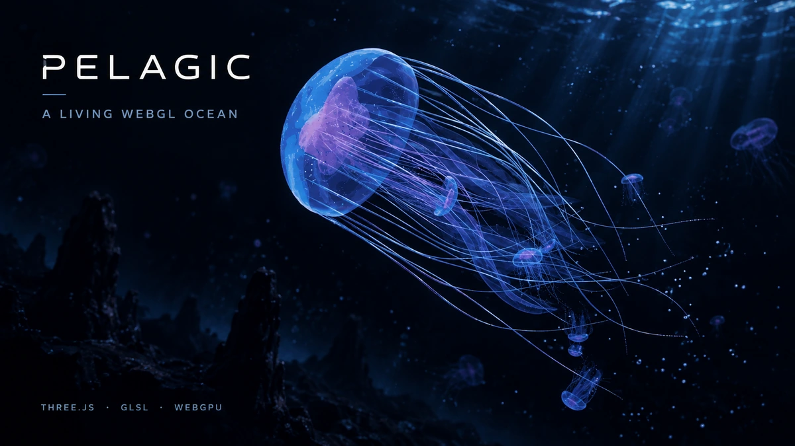
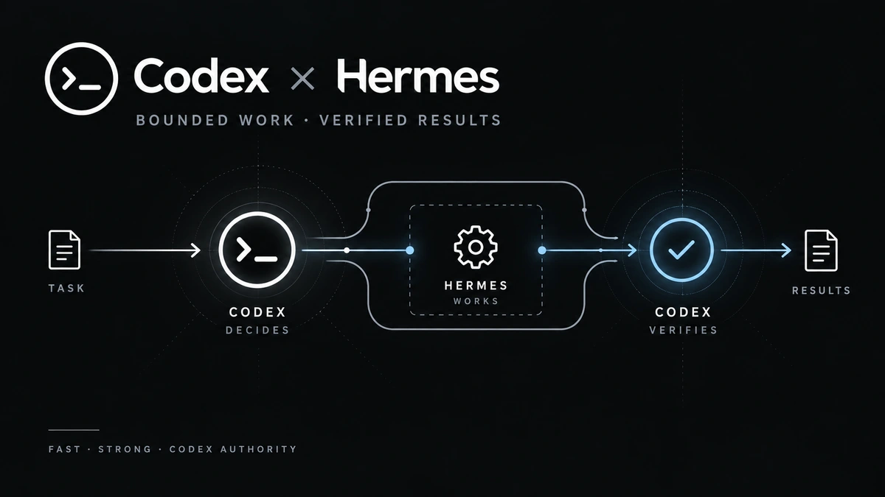
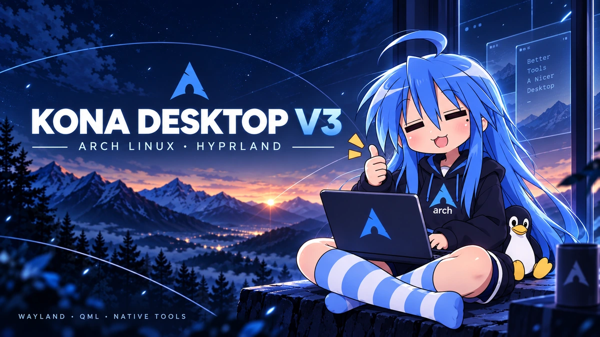

# MANI MARAMI MILANI

**Computer Science × Mathematics** 
Building cinematic systems, developer tools, and unusually polished Linux experiences.

**Government of Canada · Agriculture and Agri-Food Canada** 
FSWEP → Intern Co-op I → Intern Co-op II → Intern Co-op III

[Portfolio](https://manimarami.com) · [GitHub projects](https://github.com/Denoax?tab=repositories) · [Pelagic live experience](https://denoax.github.io/pelagic-jellyfish-webgl/)

